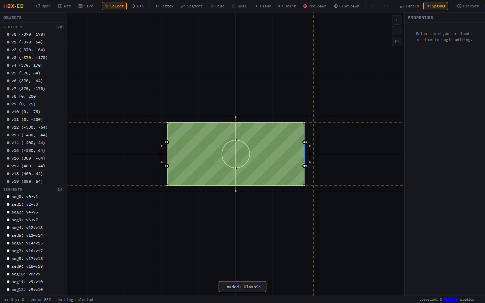

<h1 align="center">HBX-ED</h1>

<p align="center">
  <strong>A visual stadium editor for HaxBall <code>.hbs</code> files.</strong>
</p>

<p align="center">
  Design arenas, edit geometry, validate maps, preview layouts, and export playable stadium files from one focused browser workspace.
</p>

<p align="center">
  <a href="https://github.com/mertushka/hbx-ed/actions/workflows/ci.yml"></a>
  <a href="https://github.com/mertushka/hbx-ed/actions/workflows/ci.yml"></a>
  <a href="https://codecov.io/gh/mertushka/hbx-ed"></a>
  
  
  <a href="LICENSE"></a>
</p>

<p align="center">
  <a href="#features">Features</a>
  |
  <a href="#quick-start">Quick Start</a>
  |
  <a href="#shortcuts">Shortcuts</a>
  |
  <a href="#contributing">Contributing</a>
</p>

<p align="center">
  
</p>

---

## Overview

HBX-ED turns HaxBall stadium editing into a visual workflow. Instead of hand-tuning a JSON-like file and hoping the geometry lines up, you can place objects on a canvas, inspect the stadium tree, edit properties in context, validate the file, and save a clean `.hbs` stadium.

It is built for map makers who want fast iteration without giving up control over the underlying HaxBall stadium format.

## Features

<table>
  <tr>
    <td width="50%">
      <h3>Canvas-first editing</h3>
      <p>Place, select, pan, zoom, and inspect stadium objects directly on the field.</p>
    </td>
    <td width="50%">
      <h3>Complete object coverage</h3>
      <p>Edit vertexes, segments, discs, goals, planes, joints, and red/blue spawn points.</p>
    </td>
  </tr>
  <tr>
    <td width="50%">
      <h3>Property controls</h3>
      <p>Fine-tune selected objects from a side panel instead of hunting through raw file text.</p>
    </td>
    <td width="50%">
      <h3>Object tree</h3>
      <p>Browse stadium objects by group, select exact items, and keep complex maps navigable.</p>
    </td>
  </tr>
  <tr>
    <td width="50%">
      <h3>Validation feedback</h3>
      <p>Catch invalid references, duplicate segments, suspicious traits, and degenerate geometry.</p>
    </td>
    <td width="50%">
      <h3>Preview and export</h3>
      <p>Open a HaxBall-like preview, adjust the view, and export a stadium PNG.</p>
    </td>
  </tr>
</table>

## Editing Toolkit

| Workflow      | Included                                                     |
| ------------- | ------------------------------------------------------------ |
| Create        | Blank grass, classic, hockey, and empty templates            |
| Modify        | Move, edit, duplicate, delete, copy, paste                   |
| Navigate      | Zoom, pan, object tree selection, context menus              |
| Validate      | Geometry checks, reference checks, trait warnings            |
| Import/export | Open existing `.hbs` files and save compatible output        |
| Preview       | Full-screen preview canvas with zoom controls and PNG export |

## Quick Start

```sh
npm i
npm run dev
```

Then open the local Vite URL shown in your terminal.

Build the production bundle:

```sh
npm run build
```

Run the project quality gate:

```sh
npm run check
```

## Shortcuts

| Shortcut            | Action               |
| ------------------- | -------------------- |
| `V`                 | Select               |
| `H`                 | Pan                  |
| `A`                 | Add vertex           |
| `S`                 | Add segment          |
| `D`                 | Add disc             |
| `G`                 | Add goal             |
| `P`                 | Add plane            |
| `J`                 | Add joint            |
| `R`                 | Add red spawn        |
| `B`                 | Add blue spawn       |
| `Ctrl+Z` / `Ctrl+Y` | Undo / redo          |
| `Ctrl+C` / `Ctrl+V` | Copy / paste         |
| `Ctrl+D`            | Duplicate            |
| `I`                 | Toggle vertex labels |
| `O`                 | Toggle spawn points  |
| `?`                 | Show shortcuts       |

## Project Status

HBX-ED is in active development.

## Contributing

Technical setup, architecture notes, test strategy, and pull request expectations live in [CONTRIBUTING.md](CONTRIBUTING.md).

## Credits

Created and maintained by [mertushka](https://github.com/mertushka).

## License

[MIT](LICENSE)
